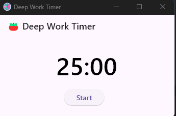

# Deep Work Timer ⏳

> **A Pomodoro-style timer designed to help you focus deeply and maximize productivity.**



## 📌 Features

✅ **Customizable Timer** – Set work & break durations  
✅ **Minimalist UI** – Simple, distraction-free design  
✅ **Always-on-Top Mode** – Keeps the timer visible  
✅ **Sound Notifications** – Alerts when time's up  
✅ **Cross-Platform** – Works on Windows, macOS, and Linux

---

## 🚀 Installation

### 1️⃣ Clone the Repository

```bash
git clone https://github.com/vkhangstack/Deep-Work-Timer.git
cd Deep-Work-Timer
```

### 2️⃣ Install Dependencies

```bash
flutter pub get
```

### 3️⃣ Run the App

```bash
flutter run
```

For a desktop build (Windows/Linux/macOS), enable desktop support:

## 🖥️ Screenshots


## 🛠️ Technologies Used

Flutter – Cross-platform framework \
Provider – State management \
window_manager – Custom window controls \
audioplayers – Sound notifications

## 📝 Roadmap

🔲 Add task tracking 📋 \
🔲 Sync progress across devices 🌍 \
🔲 Dark mode 🌙

## 🤝 Contributing

Contributions are welcome!

Fork the repository
Create a new branch (feature/new-feature)
Commit changes (git commit -m "Added feature XYZ")
Push to GitHub & create a pull request

## 📜 License

This project is licensed under the MIT License. See LICENSE for details.

📧 Contact: \
📌 Author: Pham Van Khang \
📌 GitHub: @vkhangstack \
📌 Email: phamvankhang.tvi@gmail.com
